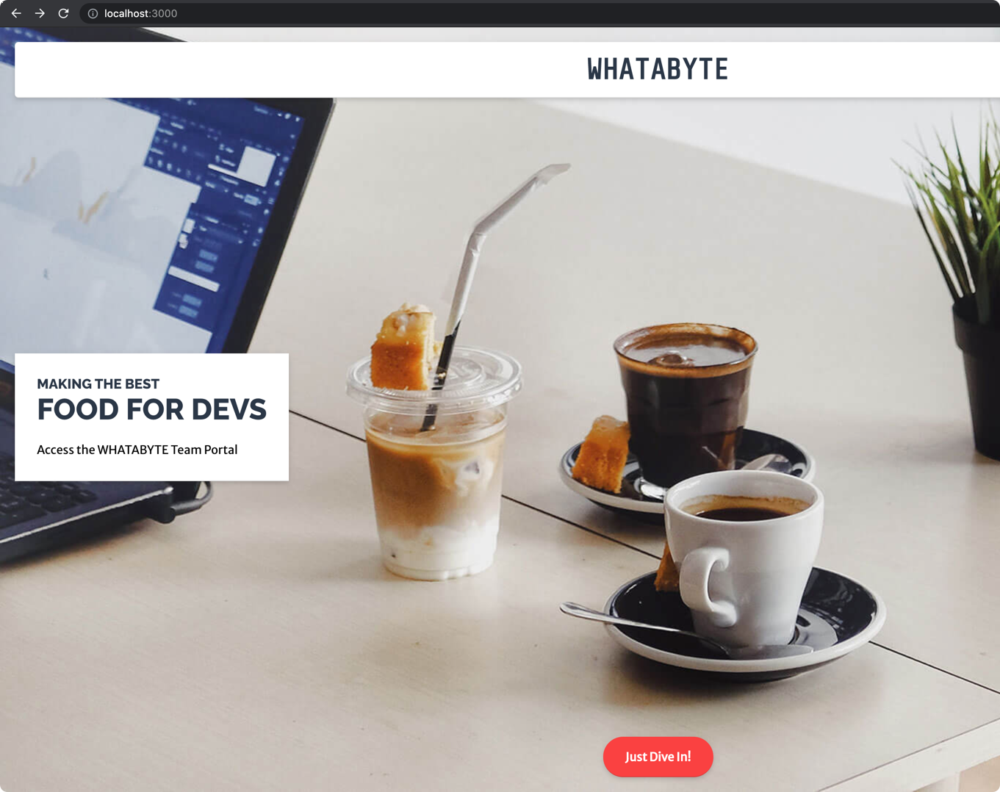

[node-express-app](https://auth0.com/blog/create-a-simple-and-stylish-node-express-app/)

- Create dir

```bash
$ mkdir whatabyte-portal
$ node -v                   
v16.2.0
$ npm -v           
7.13.0
```


- Init

```bash
$ npm init -y

{
  "name": "whatabyte-portal",
  "version": "1.0.0",
  "description": "",
  "main": "index.js",
  "scripts": {
    "test": "echo \"Error: no test specified\" && exit 1"
  },
  "keywords": [],
  "author": "",
  "license": "ISC"
}
```

- Entrypoint to app

```bash
touch index.js

```

- Install nodemon as a development dependency:

```bash
npm i -D nodemon
```

- Create a dev script command in your package.json file to run nodemon and delete the test script:


- To use the Express framework in your application, install it as a project dependency:

```bash
$ npm i express
```

Edit index.js

- Run the application
[if you get stuck](https://stackoverflow.com/questions/35530930/nodemon-not-working-bash-nodemon-command-not-found)

```bash
$ npm run dev


> whatabyte-portal@1.0.0 dev
> nodemon ./index.js

[nodemon] 2.0.12
[nodemon] to restart at any time, enter `rs`
[nodemon] watching path(s): *.*
[nodemon] watching extensions: js,mjs,json
[nodemon] starting `node ./index.js`
Listening to requests on http://localhost:8000


```

- Test

```bash
$ curl localhost:8000  
WHATABYTE: Food For Devs
```

- Install pub

```bash
$ npm i pug

$ mkdir views

$ touch views/layout.pug

$ touch views/index.pug

```

- Add Live Reload to Express Using Browsersync


```bash
$ npm i -D browser-sync
$ browser-sync init
zsh: command not found: browser-sync
## Okay what ?
## https://stackoverflow.com/questions/35500178/browsersync-command-not-found-after-installing-browser-sync

$ npm install -g browser-sync
$ browser-sync init          
Config file created bs-config.js
To use it, in the same directory run: browser-sync start --config bs-config.js

## Humm okay, if it works!

```

- Next, create an npm script that configures and runs Browsersync to serve your web pages. Open and update package.json with the following ui npm script:

- To serve the user interface of your Express app, run the following command in a separate terminal window:

```bash
$ npm run ui

> whatabyte-portal@1.0.0 ui
> browser-sync start --config bs-config.js

[Browsersync] Proxying: http://localhost:8000
[Browsersync] Access URLs:
 -----------------------------------
    Local: http://localhost:3000
 External: http://192.168.0.143:3000
 -----------------------------------
[Browsersync] Watching files...
```

- Serve Static Assets with Express

```bash
$ mkdir public

$ touch public/style.css

$ touch views/user.pug

```

- Running and doing brower sync in two different terminals

```bash
$ npm run dev

> whatabyte-portal@1.0.0 dev
> nodemon ./index.js

[nodemon] 2.0.12
[nodemon] to restart at any time, enter `rs`
[nodemon] watching path(s): *.*
[nodemon] watching extensions: js,mjs,json
[nodemon] starting `node ./index.js`
Listening to requests on http://localhost:8000
[nodemon] restarting due to changes...
[nodemon] starting `node ./index.js`
Listening to requests on http://localhost:8000
[nodemon] restarting due to changes...
[nodemon] starting `node ./index.js`
Listening to requests on http://localhost:8000

```

```bash
$ npm run ui

> whatabyte-portal@1.0.0 ui
> browser-sync start --config bs-config.js

[Browsersync] Proxying: http://localhost:8000
[Browsersync] Access URLs:
 -----------------------------------
    Local: http://localhost:3000
 External: http://192.168.0.143:3000
 -----------------------------------
[Browsersync] Watching files...
[Browsersync] Reloading Browsers...
[Browsersync] Reloading Browsers...
[Browsersync] File event [change] : public/style.css
[Browsersync] File event [change] : public/style.css
[Browsersync] Reloading Browsers...
[Browsersync] Reloading Browsers...
[Browsersync] Reloading Browsers...
[Browsersync] Reloading Browsers...
[Browsersync] File event [change] : public/style.css

```


- Screenshots



